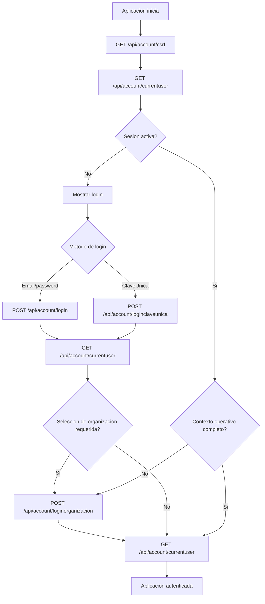
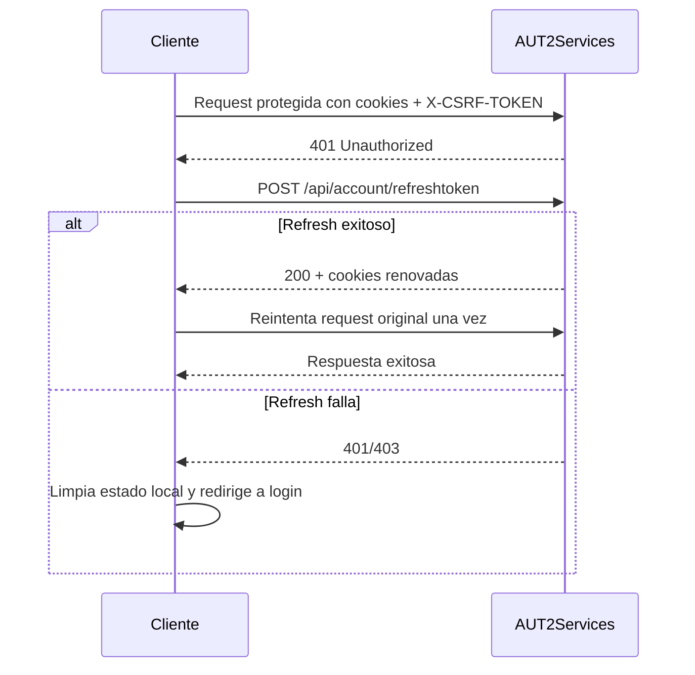
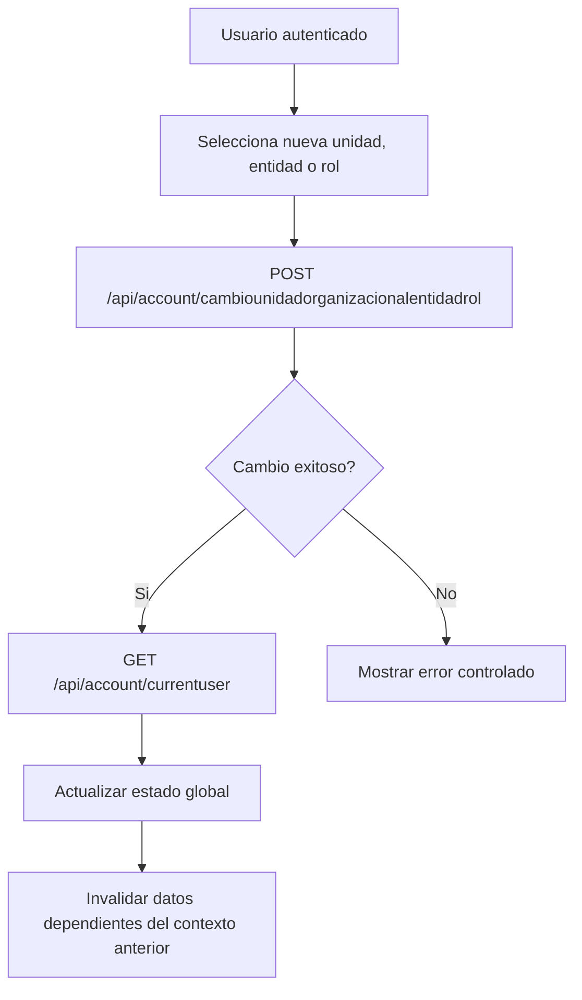

# Guia para Equipos Tecnicos de Integracion

## Objetivo

Esta guia entrega una referencia tecnica para equipos que deben integrar, mantener o extender clientes que consumen la seguridad implementada en AUT2Services.

El foco esta en integracion, contratos y comportamiento observable del sistema, no en detalle interno de codigo.

---

## Principios de integracion

- la sesion se transporta mediante cookies (`accesstoken`, `refreshToken`);
- las operaciones mutantes requieren CSRF (`XSRF-TOKEN` + `X-CSRF-TOKEN`);
- el cliente no debe persistir manualmente tokens si puede usar cookies;
- la sesion puede requerir dos etapas: autenticacion base y fijacion de contexto (`LoginOrganizacion`);
- existe autenticacion externa mediante ClaveUnica (`LoginClaveUnica`);
- el estado de sesion se reconstruye usando `GET /api/account/currentuser`.

---

## Endpoints principales

### Autenticacion y sesion

- `POST /api/account/register`
- `POST /api/account/login`
- `POST /api/account/loginclaveunica`
- `POST /api/account/loginorganizacion`
- `POST /api/account/cambiounidadorganizacionalentidadrol`
- `POST /api/account/refreshtoken`
- `POST /api/account/logout`

### Email y validacion

- `POST /api/account/confirmemail`
- `POST /api/account/resendconfirmationemail`

### Recuperacion de clave

- `POST /api/account/solicitarecuperacionclave`
- `POST /api/account/reenviacodigorecuperacionclave`
- `POST /api/account/confirmarecuperacionclave`

### Estado de sesion

- `GET /api/account/csrf`
- `GET /api/account/currentuser` (AllowAnonymous)
- `GET /api/account/miinformacion` (Authorize)

---

## Flujo tecnico de integracion

### 1. Inicializacion

- llamar `GET /api/account/csrf`;
- capturar cookie `XSRF-TOKEN`;
- configurar cliente HTTP para enviar cookies automaticamente.

### 2. CSRF

Regla obligatoria para endpoints mutantes:

- enviar cookie `XSRF-TOKEN`;
- enviar header `X-CSRF-TOKEN` con el mismo valor.

Notas:

- el endpoint `csrf` puede responder sin body (204);
- la cookie puede rotar, el cliente debe usar siempre el ultimo valor;
- errores de CSRF se manifiestan como 400/403.

### 3. Registro

Contrato:

- endpoint: `POST /api/account/register`
- payload: datos personales + password + terminos
- requiere CSRF

Resultado:

- usuario creado;
- sin sesion;
- email debe ser confirmado.

### 4. Confirmacion de email

Contrato:

- endpoint: `POST /api/account/confirmemail`
- payload: `UserId`, `Token`
- requiere CSRF

### 5. Login

#### Login tradicional

- endpoint: `POST /api/account/login`
- payload: `email`, `password`
- requiere CSRF

Resultado:

- cookies de sesion emitidas;
- puede requerir seleccion de organizacion.

#### Login ClaveUnica

- endpoint: `POST /api/account/loginclaveunica`
- payload: `clientId`, `redirectUri`, `code`, `state`
- requiere CSRF

Resultado:

- cookies emitidas si validacion externa es correcta;
- flujo posterior identico al login tradicional.

### 6. Estado de sesion

- endpoint: `GET /api/account/currentuser`

Usos:

- reconstruir estado al iniciar app;
- detectar autenticacion;
- detectar si falta seleccion de organizacion;
- obtener roles, organizaciones y unidades disponibles.

Importante:

- este endpoint es AllowAnonymous;
- si hay cookies validas, devuelve contexto;
- si no, devuelve estado anonimo.

### 7. LoginOrganizacion

Contrato:

- endpoint: `POST /api/account/loginorganizacion`
- payload: `Organizacion`
- requiere CSRF

Resultado:

- fija organizacion/rol operativo;
- rota sesion;
- invalida refresh token anterior.

### 8. Cambio de contexto

Contrato:

- endpoint: `POST /api/account/cambiounidadorganizacionalentidadrol`
- requiere autorizacion y CSRF

Uso:

- cambiar unidad organizacional, entidad o rol sin cerrar sesion;
- debe ir seguido de una llamada a `currentuser` para sincronizar estado.

### 9. Refresh

Contrato:

- endpoint: `POST /api/account/refreshtoken`
- requiere CSRF

Flujo:

1. detectar `401`;
2. ejecutar refresh una sola vez;
3. si es exitoso, reintentar request original;
4. si falla, invalidar estado local y forzar login.

Consideraciones:

- mantiene contexto operativo;
- puede rotar cookies y CSRF;
- no debe ejecutarse en bucle.

### 10. Logout

Contrato:

- endpoint: `POST /api/account/logout`
- requiere CSRF

Resultado:

- invalida sesion en servidor;
- elimina cookies;
- cliente debe limpiar estado.

---

## Diagramas de flujo de sesion

Los diagramas siguientes muestran las decisiones minimas que debe implementar un cliente. No reemplazan validaciones de UI ni reglas de negocio propias de cada aplicacion.

### Flujo de entrada



### Refresh ante expiracion



### Cambio de contexto operativo



---

## Implementacion de referencia minima

La implementacion de referencia debe tener cuatro piezas. Si una integracion no las separa, termina duplicando logica y aumentando errores.

```text
src/
  auth/
    account-api.ts        # rutas HTTP puras
    csrf.ts               # lectura de XSRF-TOKEN
    auth-client.ts        # login, currentuser, refresh, logout
    auth-interceptor.ts   # cookies, CSRF y retry controlado ante 401
```

### account-api.ts

```ts
export interface LoginRequest {
  email: string;
  password: string;
}

export interface LoginClaveUnicaRequest {
  clientId: string;
  redirectUri: string;
  code: string;
  state: string;
}

export interface LoginOrganizacionRequest {
  Organizacion: string;
}

export class AccountApi {
  constructor(private readonly http: HttpClientLike) {}

  csrf() {
    return this.http.get('/api/account/csrf');
  }

  login(payload: LoginRequest) {
    return this.http.post('/api/account/login', payload);
  }

  loginClaveUnica(payload: LoginClaveUnicaRequest) {
    return this.http.post('/api/account/loginclaveunica', payload);
  }

  currentUser() {
    return this.http.get('/api/account/currentuser');
  }

  loginOrganizacion(payload: LoginOrganizacionRequest) {
    return this.http.post('/api/account/loginorganizacion', payload);
  }

  cambioUnidadOrganizacionalEntidadRol(payload: unknown) {
    return this.http.post('/api/account/cambiounidadorganizacionalentidadrol', payload);
  }

  refreshToken() {
    return this.http.post('/api/account/refreshtoken', {});
  }

  logout() {
    return this.http.post('/api/account/logout', {});
  }
}
```

### csrf.ts

```ts
export function readXsrfToken(): string | null {
  return readCookie('XSRF-TOKEN');
}

function readCookie(name: string): string | null {
  if (typeof document === 'undefined') {
    return null;
  }

  const prefix = `${name}=`;
  const cookie = document.cookie
    .split(';')
    .map(value => value.trim())
    .find(value => value.startsWith(prefix));

  return cookie
    ? decodeURIComponent(cookie.substring(prefix.length))
    : null;
}
```

### auth-client.ts

```ts
export class AuthClient {
  constructor(private readonly accountApi: AccountApi) {}

  async bootstrapSession() {
    await this.accountApi.csrf();
    return this.accountApi.currentUser();
  }

  async login(payload: LoginRequest) {
    await this.accountApi.csrf();
    await this.accountApi.login(payload);
    return this.accountApi.currentUser();
  }

  async loginClaveUnica(payload: LoginClaveUnicaRequest) {
    await this.accountApi.csrf();
    await this.accountApi.loginClaveUnica(payload);
    return this.accountApi.currentUser();
  }

  async seleccionarOrganizacion(payload: LoginOrganizacionRequest) {
    await this.accountApi.loginOrganizacion(payload);
    return this.accountApi.currentUser();
  }

  async cambiarContexto(payload: unknown) {
    await this.accountApi.cambioUnidadOrganizacionalEntidadRol(payload);
    return this.accountApi.currentUser();
  }

  async logout() {
    await this.accountApi.logout();
  }
}
```

### auth-interceptor.ts

```ts
let refreshInProgress: Promise<unknown> | null = null;

export async function requestWithAuthRetry(
  request: () => Promise<Response>,
  refreshToken: () => Promise<unknown>
): Promise<Response> {
  const response = await request();

  if (response.status !== 401) {
    return response;
  }

  if (!refreshInProgress) {
    refreshInProgress = refreshToken().finally(() => {
      refreshInProgress = null;
    });
  }

  await refreshInProgress;

  return request();
}
```

Reglas de esta referencia:

- `AccountApi` no decide navegacion ni estado visual;
- `AuthClient` orquesta flujos de sesion;
- el interceptor agrega CSRF y controla refresh;
- `currentuser` actualiza el estado global despues de login, seleccion de organizacion y cambio de contexto;
- nunca se persisten tokens manualmente.

---

## Ejemplos de integracion por tecnologia

Los ejemplos siguientes muestran el patron recomendado por tipo de cliente. No buscan cubrir toda la aplicacion, sino dejar claro donde deben resolverse cookies, CSRF, refresh y reconstruccion de sesion.

### Angular

En Angular, la integracion recomendada es separar responsabilidades:

- `AccountApi`: solo conoce rutas HTTP;
- `AuthService`: orquesta login, currentuser, refresh y logout;
- `HttpInterceptor`: agrega CSRF, cookies y maneja refresh ante `401`.

No conviene resolver CSRF manualmente en cada componente.

```ts
@Injectable({ providedIn: 'root' })
export class AccountApi {
  private readonly http = inject(HttpClient);
  private readonly baseUrl = '/api/account';

  csrf() {
    return this.http.get<void>(`${this.baseUrl}/csrf`, {
      withCredentials: true
    });
  }

  login(payload: { email: string; password: string }) {
    return this.http.post(`${this.baseUrl}/login`, payload, {
      withCredentials: true
    });
  }

  loginClaveUnica(payload: {
    clientId: string;
    redirectUri: string;
    code: string;
    state: string;
  }) {
    return this.http.post(`${this.baseUrl}/loginclaveunica`, payload, {
      withCredentials: true
    });
  }

  currentUser() {
    return this.http.get(`${this.baseUrl}/currentuser`, {
      withCredentials: true
    });
  }

  loginOrganizacion(payload: { Organizacion: string }) {
    return this.http.post(`${this.baseUrl}/loginorganizacion`, payload, {
      withCredentials: true
    });
  }

  refreshToken() {
    return this.http.post(`${this.baseUrl}/refreshtoken`, {}, {
      withCredentials: true
    });
  }

  logout() {
    return this.http.post(`${this.baseUrl}/logout`, {}, {
      withCredentials: true
    });
  }
}
```

```ts
export const authInterceptor: HttpInterceptorFn = (req, next) => {
  const xsrfToken = readCookie('XSRF-TOKEN');

  const request = req.clone({
    withCredentials: true,
    setHeaders: xsrfToken
      ? { 'X-CSRF-TOKEN': xsrfToken }
      : {}
  });

  return next(request);
};

function readCookie(name: string): string | null {
  const prefix = `${name}=`;
  const cookie = document.cookie
    .split(';')
    .map(value => value.trim())
    .find(value => value.startsWith(prefix));

  return cookie
    ? decodeURIComponent(cookie.substring(prefix.length))
    : null;
}
```

Nota critica:

- el interceptor no debe intentar refrescar infinitamente;
- ante `401`, debe ejecutar `refreshtoken` una sola vez y luego reintentar la request original;
- si el refresh falla, se debe limpiar estado local y redirigir a login.

### React

En React, el patron recomendado es usar una instancia HTTP unica. No conviene configurar `credentials`, CSRF o refresh en cada componente.

La UI debe consumir un `AuthProvider` o hook de sesion. Los componentes no deberian conocer detalles de cookies, CSRF ni refresh.

```ts
import axios from 'axios';

export const api = axios.create({
  baseURL: '/api',
  withCredentials: true
});

api.interceptors.request.use((config) => {
  const xsrfToken = readCookie('XSRF-TOKEN');

  if (xsrfToken) {
    config.headers['X-CSRF-TOKEN'] = xsrfToken;
  }

  return config;
});

function readCookie(name: string): string | null {
  const prefix = `${name}=`;
  const cookie = document.cookie
    .split(';')
    .map(value => value.trim())
    .find(value => value.startsWith(prefix));

  return cookie
    ? decodeURIComponent(cookie.substring(prefix.length))
    : null;
}
```

```ts
export const accountApi = {
  csrf: () => api.get('/account/csrf'),

  login: (payload: { email: string; password: string }) =>
    api.post('/account/login', payload),

  loginClaveUnica: (payload: {
    clientId: string;
    redirectUri: string;
    code: string;
    state: string;
  }) =>
    api.post('/account/loginclaveunica', payload),

  currentUser: () =>
    api.get('/account/currentuser'),

  loginOrganizacion: (payload: { Organizacion: string }) =>
    api.post('/account/loginorganizacion', payload),

  refreshToken: () =>
    api.post('/account/refreshtoken', {}),

  logout: () =>
    api.post('/account/logout', {})
};
```

```ts
let refreshing = false;

api.interceptors.response.use(
  response => response,
  async error => {
    const originalRequest = error.config;

    if (
      error.response?.status === 401 &&
      !originalRequest._retry &&
      !refreshing
    ) {
      originalRequest._retry = true;
      refreshing = true;

      try {
        await accountApi.refreshToken();
        return api(originalRequest);
      } finally {
        refreshing = false;
      }
    }

    return Promise.reject(error);
  }
);
```

Nota critica:

- no guardar `accesstoken` ni `refreshToken` en `localStorage`;
- si la aplicacion esta en navegador y la API emite cookies, persistir tokens manualmente aumenta superficie de ataque y duplica estado.

### Vue / Nuxt

En Vue o Nuxt, la integracion debe resolverse en un plugin o composable compartido. Los componentes no deben conocer la mecanica de CSRF ni refresh.

```ts
export async function apiFetch<T>(
  path: string,
  options: RequestInit = {}
): Promise<T> {
  const xsrfToken = readCookie('XSRF-TOKEN');

  const response = await fetch(`/api${path}`, {
    ...options,
    credentials: 'include',
    headers: {
      'Content-Type': 'application/json',
      ...(xsrfToken ? { 'X-CSRF-TOKEN': xsrfToken } : {}),
      ...(options.headers ?? {})
    }
  });

  if (!response.ok) {
    throw response;
  }

  return response.json() as Promise<T>;
}

function readCookie(name: string): string | null {
  const prefix = `${name}=`;
  const cookie = document.cookie
    .split(';')
    .map(value => value.trim())
    .find(value => value.startsWith(prefix));

  return cookie
    ? decodeURIComponent(cookie.substring(prefix.length))
    : null;
}
```

```ts
export const authClient = {
  csrf: () =>
    apiFetch<void>('/account/csrf', { method: 'GET' }),

  login: (payload: { email: string; password: string }) =>
    apiFetch('/account/login', {
      method: 'POST',
      body: JSON.stringify(payload)
    }),

  currentUser: () =>
    apiFetch('/account/currentuser', { method: 'GET' }),

  refreshToken: () =>
    apiFetch('/account/refreshtoken', { method: 'POST' }),

  logout: () =>
    apiFetch('/account/logout', { method: 'POST' })
};
```

Nota critica para Nuxt SSR:

- si se usa Nuxt con SSR, no asumir que `document.cookie` existe en servidor;
- en SSR se debe leer la cookie desde el request entrante y reenviarla al backend de forma explicita;
- en cliente puede usarse `document.cookie`.

### .NET / servicio backend o legacy

Si el integrador es un servicio .NET o una aplicacion legacy, debe conservar cookies entre llamadas usando `CookieContainer`. Sin eso, login, CSRF y refresh no funcionan de forma confiable.

```csharp
var cookieContainer = new CookieContainer();

var handler = new HttpClientHandler
{
    CookieContainer = cookieContainer,
    UseCookies = true
};

using var http = new HttpClient(handler)
{
    BaseAddress = new Uri("https://host-api/api/account/")
};

await http.GetAsync("csrf");

var cookies = cookieContainer.GetCookies(new Uri("https://host-api"));
var xsrfToken = cookies["XSRF-TOKEN"]?.Value;

var request = new HttpRequestMessage(HttpMethod.Post, "login")
{
    Content = JsonContent.Create(new
    {
        email = "usuario@dominio.cl",
        password = "password"
    })
};

request.Headers.Add("X-CSRF-TOKEN", xsrfToken);

var response = await http.SendAsync(request);
response.EnsureSuccessStatusCode();
```

Nota critica:

- no crear un `HttpClient` nuevo por cada request si se necesita conservar cookies;
- el `CookieContainer` debe vivir al menos durante la sesion de integracion;
- en integraciones multiusuario, no compartir el mismo `CookieContainer` entre usuarios distintos.

---

## Manejo de errores

Casos relevantes:

- `401`: sesion expirada -> intentar refresh;
- `403` o `400`: error CSRF;
- `429`: rate limiting en resend o recuperacion;
- login bloqueado si email no confirmado.

---

## Buenas practicas de mantenimiento

- centralizar autenticacion en un unico modulo;
- no duplicar rutas de endpoints en multiples servicios;
- usar `currentuser` como unica fuente de verdad del estado;
- refrescar estado despues de loginorganizacion y cambio de contexto;
- evitar depender de datos cacheados cuando cambian cookies;
- monitorear respuestas inconsistentes de backend y normalizarlas en cliente.

---

## Errores frecuentes

- usar rutas antiguas como `/login-2` o `/refresh`;
- olvidar `GET /csrf` antes de POST;
- no sincronizar cookie y header CSRF;
- no reenviar cookies;
- asumir que login deja la sesion completa lista;
- no manejar correctamente `currentuser`;
- ignorar `429` en endpoints protegidos por rate limiting.

---

## Resumen

La integracion correcta depende de tres capacidades clave:

1. manejo de cookies;
2. manejo correcto de CSRF;
3. soporte para flujo de sesion en dos etapas y cambio de contexto.

Si estos tres puntos estan bien resueltos, la integracion es estable, predecible y mantenible.
